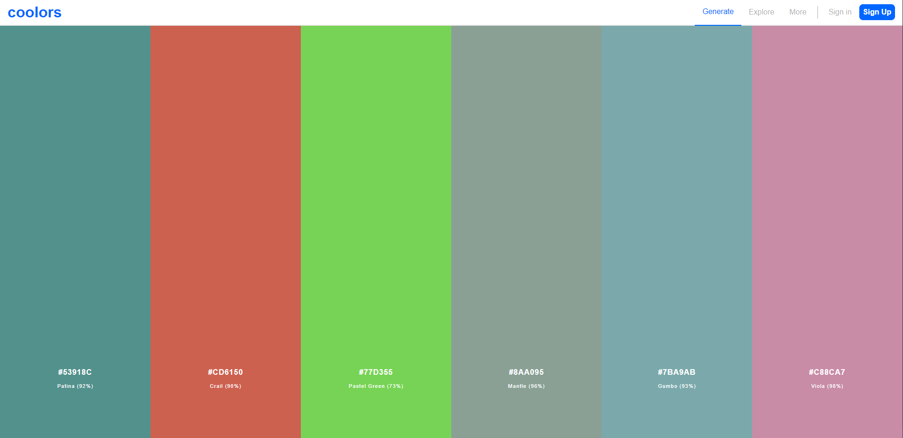

# Coloors Clone Using VueJs



# Todo

## Colors
- [ ] Color lock
- [ ] Color dragging
- [ ] Copy HEX
- [ ] Colors toolbar
- [ ] Custom amount of colors

## Others
- [ ] Using firebase for sign up / sign in
- [ ] Using firebase for saving palette

## Project Setup
In order to setup the project, you first have to install deps using:
```
npm install
```

Then, you can run this command to start the local server
```
npm run serve
```
